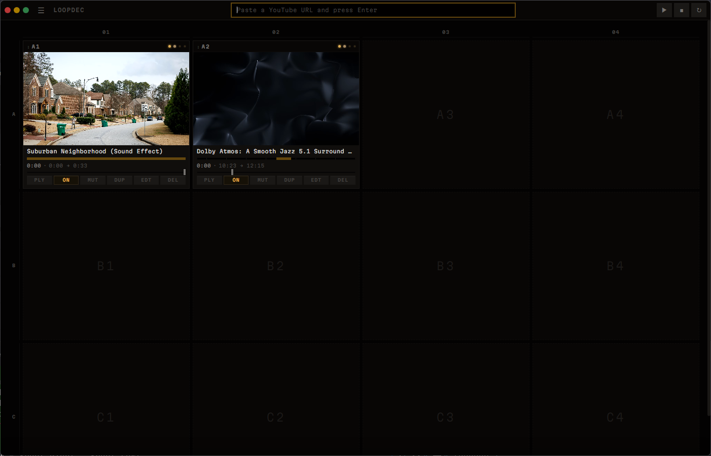
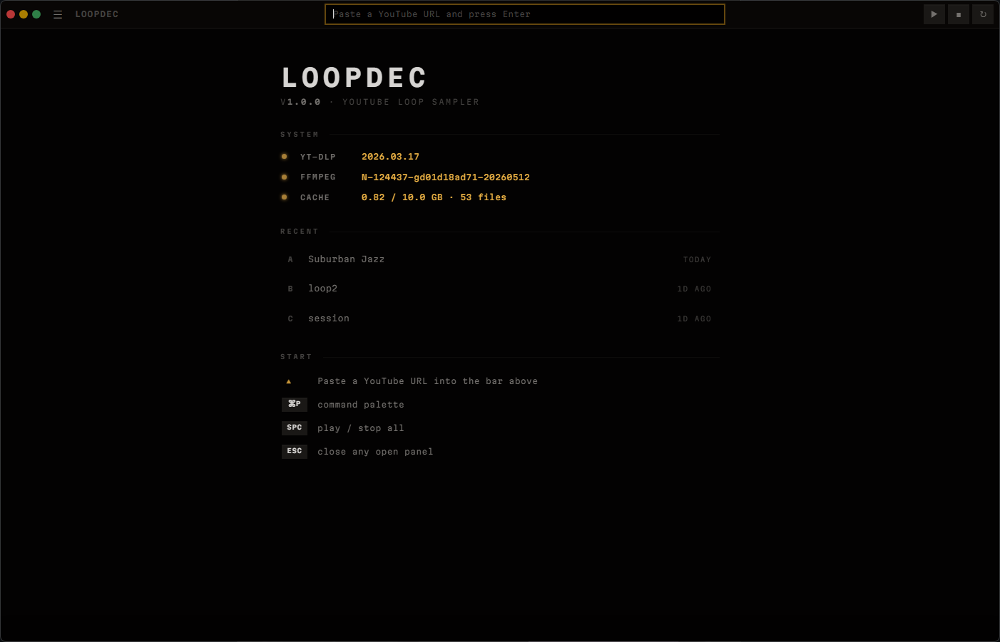
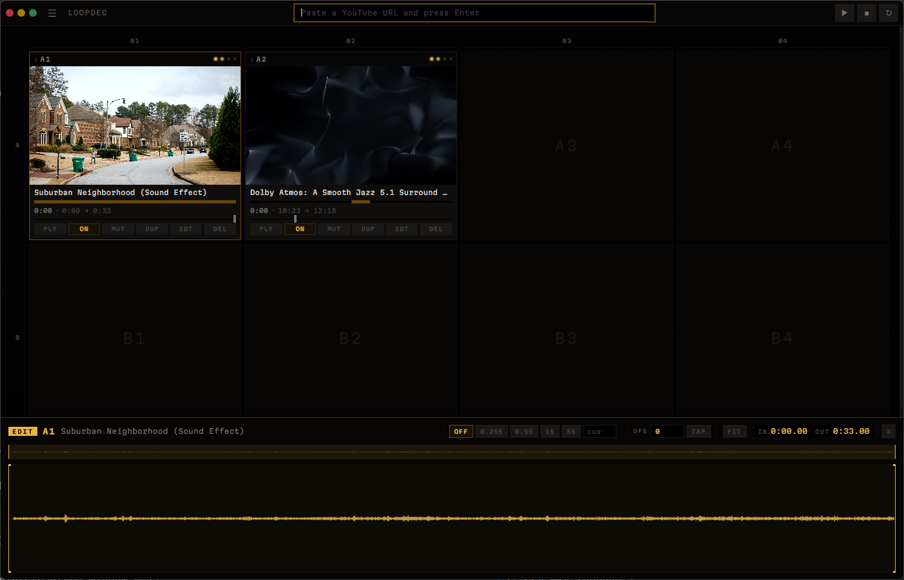

# LoopDec

A personal YouTube loop sampler. Drop URLs, chop them into a fixed pad bank, loop and layer in real time. Built as a workshop tool for jamming — one user, headphones, no accounts, no cloud.



## What it does

Each pad holds one YouTube clip with its own loop region. Pads live in a fixed grid you can play in parallel — start them individually, sync them all from the transport, or swap them between cells to rearrange the bank. The whole thing is shaped like a hardware sampler: addressable pads (A1, B3…), recessed LCD screens, amber/green tally LEDs.

## Features

- **Pad bank** — addressable grid (4×3 default, configurable up to 10×10) with row/column gutters, drag-to-swap, click-to-play
- **Per-pad loop editor** — waveform with draggable in/out handles, snap-to-grid, scroll-zoom, shift+scroll pan, minimap navigator
- **Sample-accurate playback** — Web Audio loop nodes; video is muted and slaved to audio drift (>150ms triggers a seek)
- **Master transport** — play all / stop all / sync-restart all enabled pads in lockstep
- **Auto-managed binaries** — yt-dlp and ffmpeg download themselves on first run, refresh daily/monthly in the background
- **Decks** — save sessions to `.dec` files; recent decks are surfaced on the idle screen and in the command palette
- **Smart cache** — cap how much disk audio + video uses; least-recently-used clips evict automatically; clips referenced by your current deck are protected
- **No accounts, no telemetry** — everything lives in your OS userData dir

## Screenshots

### Idle screen
The instrument waits with system status, recent decks, and key bindings on display.



### Loaded deck
Pads addressed by row letter + column number. Tally LEDs glow per state — amber for enabled/loaded, green for playing, red for muted. Drag the `⋮⋮` handle to move a pad to any other cell.


### Waveform editor
Click a pad's body or `EDT` to open the loop editor. Drag the amber handles to set in/out, click+drag empty space to select a region, scroll to zoom around the cursor, shift+scroll to pan. The minimap strip on top shows the full clip and current viewport.



## Getting started

Requires Node 22+ and npm. yt-dlp and ffmpeg install themselves on first launch (Windows only for ffmpeg auto-install; macOS/Linux users need to install ffmpeg manually for now).

```bash
git clone <repo>
cd loopdec
npm install
npm start
```

For development with incremental rebuilds:

```bash
npm run watch    # esbuild watch
npm start        # in another terminal (rebuilds + launches)
```

Type check without running:

```bash
npm run typecheck
```

## Keyboard

| Key            | Action                           |
|----------------|----------------------------------|
| ⌘P / Ctrl+P    | Command palette                  |
| Space          | Play / stop all enabled pads     |
| Esc            | Close any open panel             |
| Scroll         | Zoom waveform around cursor      |
| Shift+Scroll   | Pan waveform                     |

Per-pad shortcuts live on each pad: `PLY` play/pause, `ON` enable/disable, `MUT` mute, `DUP` duplicate, `EDT` open editor, `DEL` remove.

## Architecture

Three Electron processes, each bundled by esbuild from `src/`:

- `src/main/` — Node side: window, IPC handlers, yt-dlp/ffmpeg orchestration, audio extraction & chunking, peak generation, deck/manifest persistence, cache eviction
- `src/preload/` — `contextBridge` exposing a typed `window.api` to the renderer
- `src/renderer/` — UI logic split into focused modules:
  - `state` / `editor-state` — shared mutable singletons (tile maps, counters, snap, editor)
  - `grid` / `drag` — pad layout, addresses, coordinate labels, drop-targets
  - `tile` / `tile-display` — pad DOM, state mutations, indicator updates
  - `playback` / `transport` / `audio-engine` — per-pad play/pause, master controls, Web Audio loop graph
  - `waveform` — canvas drawing, handle/region drag, zoom/pan
  - `palette` / `sidebar` / `settings` / `decks` / `snap` — UI surfaces
  - `idle` / `setup-overlay` — empty-state + first-run binary downloader
- `src/shared/` — types and IPC contract imported by both ends

See `src/shared/ipc.ts` for the full API surface.

## Storage

Everything lives under Electron's `userData` directory:

- Windows: `%APPDATA%\loopdec\`
- macOS: `~/Library/Application Support/loopdec/`
- Linux: `~/.config/loopdec/`

Layout:
- `clips/` — downloaded `.mp4`, extracted `.m4a` (single or chunked), and peak files
- `manifest.json` — current session state (sources, tile positions, grid shape)
- `settings.json` — cache cap and other prefs
- `recent-decks.json` — recently opened deck file paths

Managed yt-dlp / ffmpeg binaries live in `bin/` next to the app executable (or next to the project root when running unpackaged).

## License

ISC. Personal project — use, modify, fork freely. No warranty.
